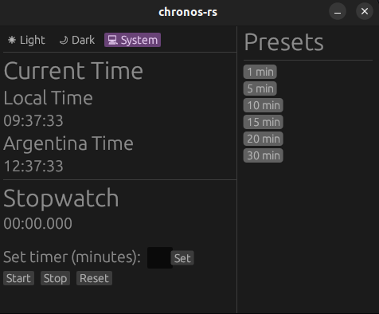

# Chronos-rs

This is a simple stopwatch application designed for personal use during my teaching sessions at the University of Buenos Aires (UBA). It helps keep track of time during lectures and courses, ensuring efficient time management while teaching.

## Features
- Customizable stopwatch with options for tracking elapsed time.
- Built for use during classes to manage session time effectively.
- Lightweight and easy to use.

## Purpose
The primary goal of this app is to provide a simple, unobtrusive timer that helps in managing class durations and keeping track of teaching sessions without the need for 3rd party apps/websites **(just an excuse to code in Rust)**.


Just run the app by executing the following:
```bash
cargo run   
```

You'll be presented with a simple and straightforward GUI:



The app is configured for my specific case which is having my local time and Argentina's time but this can be changed on main.rs.